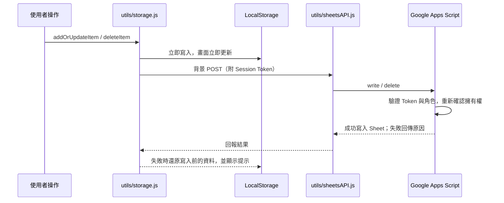

# Design LAB 內部設計資料庫

給產品設計師與前端團隊使用的內部設計知識庫：收錄 UI／動態／競品案例、AI 工具與設計資源，提供標籤篩選、全站搜尋、多媒體燈箱與 8 套主題。前端是 Vue 3 + Vite 的單頁應用；雲端資料層是 Google Sheets（透過 Google Apps Script），媒體檔案存在 Cloudflare R2。

> 設計系統的完整規格（token、字級、間距、按鈕、卡片、響應式、動態，以及每個元件的參數與範例）見設計規劃頁面：<https://claude.ai/code/artifact/b66cc05f-1401-490f-9b9f-cad8c86dea20>

---

## 目錄

- [功能總覽](#功能總覽)
- [技術棧](#技術棧)
- [快速開始](#快速開始)
- [環境變數](#環境變數)
- [建置與部署](#建置與部署)
- [目錄結構](#目錄結構)
- [路由與頁面](#路由與頁面)
- [設計系統](#設計系統)
- [元件庫](#元件庫)
- [資料層與雲端同步](#資料層與雲端同步)
- [媒體上傳](#媒體上傳)
- [帳號與權限](#帳號與權限)
- [擴充指南](#擴充指南)
- [已知限制](#已知限制)
- [授權](#授權)

---

## 功能總覽

| 功能 | 說明 |
| :--- | :--- |
| 資料模組 | UI 設計研究、動態研究、競品分析、AI 工具中心、設計資源；另有「優化提案」看板（目前從選單隱藏，網址仍可進入） |
| 首頁 | 全站搜尋入口、最新更新 4 筆、精選內容（管理員用「管理精選」勾選，改完按「儲存」才寫入） |
| 新增／編輯 | 單一表單彈窗依模組切換欄位；必填欄位有行內錯誤訊息，儲存中按鈕會顯示載入狀態 |
| 篩選與搜尋 | 類型、標籤、建立者多選篩選與排序；`⌘ K`／`Ctrl K` 跨模組搜尋並直接開啟該筆燈箱 |
| 燈箱 | 左側媒體（圖片可全螢幕放大、影片直接播放）、右側各模組的重點內容 |
| 主題 | 8 套（4 淺色／4 深色），依帳號記住偏好 |
| 雲端同步 | 本機先寫、背景推送 Google Sheets；伺服器拒絕時還原並用提示訊息說明原因 |
| 媒體 | 前端取得預簽名網址直傳 R2，附媒體庫可重複選用或刪除 |
| 權限 | Super Admin／Admin／User／Guest 四級，密碼登入，伺服器端授權 |
| 通知 | 新增、編輯、刪除、成員異動的站內通知；訪客看不到通知鈴，已讀滿三天自動清除 |

---

## 技術棧

執行環境：Node.js `>= 18`、npm `>= 9`。

| 類型 | 套件 | 版本 |
| :--- | :--- | :--- |
| 前端框架 | `vue` | `^3.5.39` |
| 建置工具 | `vite` | `^8.1.5` |
| Vue 外掛 | `@vitejs/plugin-vue` | `^6.0.7` |
| 樣式 | `tailwindcss`、`@tailwindcss/postcss`、`postcss` | `^4.3.3`、`^4.3.3`、`^8.5.26` |

沒有其他執行期相依套件：路由、狀態、HTTP、圖示、彈窗、下拉都用原生 API 與自建元件。Tailwind 只用來提供 `@theme` token 與少數工具 class，畫面樣式以專案自己的 token 與元件為主。

---

## 快速開始

```bash
npm install          # 安裝相依套件
cp .env.example .env # 填入 R2 憑證（媒體上傳才需要）
npm run dev          # 開發伺服器，預設 http://localhost:5173
npm run build        # 建置到 dist/
npm run preview      # 預覽建置結果
```

`vite.config.js` 內建 `designlab-r2-dev-api` 外掛，開發模式會直接掛上 `api/` 的三支 handler，本機不用另外啟動後端就能測上傳、列表與刪除。沒設 R2 環境變數時，其他功能照常運作，只有媒體上傳會回傳錯誤。

---

## 環境變數

R2 憑證只給後端 `api/` 使用，**不可加 `VITE_` 前綴**，否則會被打包進前端。

| 變數 | 用途 | 必填 |
| :--- | :--- | :--- |
| `R2_ACCOUNT_ID` | Cloudflare Account ID | 是 |
| `R2_ACCESS_KEY_ID` | R2 API Token 的 Access Key ID | 是 |
| `R2_SECRET_ACCESS_KEY` | R2 API Token 的 Secret Access Key | 是 |
| `R2_BUCKET_NAME` | Bucket 名稱，預設 `designlab-website` | 否 |
| `R2_PUBLIC_URL` | R2 公開存取網域 | 否 |
| `VITE_UPLOAD_API_URL` | API 與網站不同源時填 API 基礎網址 | 否 |

`VITE_UPLOAD_API_URL` 留白時，前端用 `new URL('./api/', location.href)` 推導同源路徑，例如部署在 `/designLAB/` 子目錄就對應 `/designLAB/api/`。

---

## 建置與部署

1. `npm run build` 產出 `dist/`，使用相對路徑（`base: './'`），可以放在任何子目錄，例如本機 Apache 直接提供 `dist/`。
2. **每次改完原始碼都要重新建置**。`dist/index.html` 引用的檔名帶有雜湊值，只還原 `dist/index.html` 而不重新建置會找不到對應的 JS／CSS（整頁 404）。
3. `api/` 三支檔案是 Vercel Functions handler 格式，需要部署到 Node 或 Serverless 環境；只部署 `dist/` 不會有上傳 API。用 Apache／Nginx 提供靜態檔時，要把 `/api/*` 反向代理到那個環境。
4. R2 Bucket 要設定 CORS：允許網站來源對 S3 API endpoint 發 `PUT`，並允許 `Content-Type` header。刪除由後端簽章執行，不需要開 `DELETE`。正式環境的 `AllowedOrigins` 請限定實際網域。
5. Google Apps Script 後端用 `clasp` 管理與部署，步驟見 [`apps-script/README.md`](apps-script/README.md)。

---

## 目錄結構

```text
designLAB-website/
├── index.html                    # 應用入口（lang="zh-Hant"）
├── vite.config.js                # Vite 設定＋開發用 R2 API middleware
├── postcss.config.js
├── .env.example
├── api/                          # R2 上傳 handler（Vercel Functions 格式）
│   ├── r2-upload-url.js          # SigV4 簽章、預簽名上傳網址、檔案驗證
│   ├── r2-list.js                # 列出 Bucket 內的媒體
│   └── r2-delete.js              # 刪除指定公開網址對應的物件
├── apps-script/                  # Google Apps Script 後端（帳號、密碼、寫入權限的信任邊界）
│   ├── Code.gs
│   └── README.md                 # clasp 部署與首次設定
└── src/
    ├── main.js
    ├── App.vue                   # Hash 路由、全域狀態、全域彈窗（掛在 AppShell 裡）
    ├── styles/
    │   ├── tokens.css            # 所有 token 與 8 套主題（只放「值」）
    │   ├── base.css              # reset、原生元素、全域排版、5 級斷點的變數切換
    │   └── components.css        # 跨元件共用 class（卡片狀態、骨架、彈窗內容區、下拉外觀）
    ├── views/                    # 頁面：Dashboard、UIResearch、MotionResearch、Competitor、
    │                             #       AICenter、Resources、Proposals、Settings
    ├── components/
    │   ├── base/                 # 無相依的共用元件（見「元件庫」）＋ icons.js 圖示登錄檔
    │   ├── layout/AppShell.vue   # 全站殼層
    │   ├── lightbox/             # 燈箱右側的內容區塊（文字、清單、程式碼、表格）
    │   ├── Navigation.vue        # 桌機側欄／平板圖示列／手機頂列＋抽屜
    │   ├── PageHeader.vue        # 頁面標題、副標、動作列
    │   ├── FilterToolbar.vue     # 搜尋＋篩選下拉＋已選條件
    │   ├── ResearchGrid.vue      # 五個資料模組共用的列表頁（卡片網格＋燈箱）
    │   ├── CRUDModal.vue         # 新增／編輯表單
    │   ├── SearchModal.vue       # 全站搜尋
    │   ├── MediaPickerModal.vue  # 管理精選、媒體庫共用的選擇彈窗
    │   ├── ThemePicker.vue       # 主題選擇
    │   ├── FileUploader.vue      # 上傳、預覽、媒體庫
    │   ├── ConfirmDialog.vue     # 確認對話框
    │   ├── ToastHost.vue         # 提示訊息
    │   └── NotificationBell.vue、TagInput.vue、CategoryInput.vue、ImagePathInput.vue、
    │       KeyValueListInput.vue、PromptCodeBox.vue、FullscreenMediaOverlay.vue
    ├── data/                     # 各模組初始資料，由 mockData.js 匯出
    └── utils/
        ├── storage.js            # LocalStorage CRUD、雲端寫入結果檢查與失敗回滾
        ├── sheetsAPI.js          # Apps Script 讀寫、登入與 Session Token
        ├── userStore.js          # 身分、角色、主題偏好、身分模擬
        ├── identity.js           # 身分變更的響應式訊號（切換帳號時各元件重新整理）
        ├── notifications.js      # 通知寫入、過濾與過期清理
        ├── upload.js             # 媒體驗證、預簽名上傳、列表與刪除
        ├── toast.js              # 提示訊息
        ├── confirm.js            # 確認對話框
        ├── motion.js             # 首次載入交錯淡入、捲動是否平滑
        ├── formatters.js、clipboard.js
```

---

## 路由與頁面

路由由 `App.vue` 自建，監聽 `hashchange`，用 `VIEW_ROUTES` 在網址與頁面之間互相轉換。

| Hash | 頁面 | 說明 |
| :--- | :--- | :--- |
| `#/dashboard` | `Dashboard.vue` | 搜尋入口、最新更新、精選內容 |
| `#/ui-research` | `UIResearch.vue` | UI 案例 |
| `#/motion-research` | `MotionResearch.vue` | 動態與微互動，燈箱直接播放影片 |
| `#/competitor` | `Competitor.vue` | 競品分析，含優缺點 |
| `#/ai-center` | `AICenter.vue` | AI 工具、提示詞一鍵複製、工作流程 |
| `#/resources` | `Resources.vue` | 設計規範與資源 |
| `#/proposals` | `Proposals.vue` | 優化提案看板（**目前從選單隱藏**） |
| `#/settings` | `Settings.vue` | 登入、暱稱、密碼、主題、成員管理 |

網址可以帶第二段項目 ID，例如 `#/ui-research/ui-research-1` 會開啟那一筆的燈箱。對不上的網址回到 `#/dashboard`。

---

## 設計系統

所有視覺規則都收在 token 與共用元件裡。新畫面請直接用這些，不要在元件裡寫死數值。完整規格見文件開頭的設計規劃頁面。

**Token（`src/styles/tokens.css`）**

- **三層**：原始色（每套主題各一份）→ 語意 token（元件只引用這一層：`--surface-page / card / raised / overlay`、`--text-*`、`--action-primary / on-primary / danger`、`--scrim`）→ 尺度（間距、字級、圓角、動態、層級）。
- **主題色維持原樣**：8 套主題的主色是定案，不為了對比度調整（有 6 格未達 WCAG AA，是已接受的取捨）。
- **陰影**：只有 hover 帶主色光暈（`--shadow-hover`）；靜止、下拉、彈窗一律中性灰。
- **字級**：7 個角色，一個角色一個字級。頁面標題 `--fs-page-title`（26，手機 20）、區塊／彈窗標題 `--fs-section-title`（16）、燈箱標題 22、卡片標題 15、內文 14、表單 label／按鈕 `--fs-meta`（13）、輔助資訊 `--fs-meta`（12）、數字徽章 `--fs-badge`（10，只給徽章用）。
- **間距**：區塊之間 `--space-section` 40、區塊內堆疊 `--space-stack` 16、標題到內容 `--space-heading` 12、網格 `--grid-gap` 16（≥1920 為 20）。兄弟元素之間一律用父層 `gap`。
- **圓角**：`--radius-xs / sm / md / lg / xl / 2xl / full`（4／6／10／14／18／22／膠囊）。
- **動態**：`--dur-instant / fast / base / slow / media`＋`--ease-standard / out / move`。只動 `transform`／`opacity`；離場比進場快；尊重「減少動態」設定。
- **層級**：`--z-base` 1 → `--z-raised` 10 → `--z-dropdown` 100 → `--z-sticky` 200 → `--z-drawer` 300 → `--z-modal` 1000 → `--z-modal-stacked` 1100 → `--z-lightbox` 1200 → `--z-confirm` 1250 → `--z-fullscreen` 1300 → `--z-toast` 1400。
- **疊在圖片上**：`--media-shade`、`--on-media` 等，不跟主題變。

**5 級斷點**（數值唯一依據寫在 `tokens.css` 的「斷點」註解）

| 級距 | 範圍 | 導覽 | 列表欄數 | 首頁欄數 |
| :--- | :--- | :--- | ---: | ---: |
| 超寬 | ≥1920 | 側欄 260，內容最寬 1720 置中 | 5 | 4 |
| 桌機 | 1360–1919 | 側欄 260 | 4 | 4 |
| 筆電 | 1024–1359 | 側欄 260 | 3 | 3 |
| 平板 | 641–1023 | 72px 圖示側欄 | 2 | 2 |
| 手機 | ≤640 | 頂列＋抽屜，大彈窗全高 | 1 | 1 |

另外：觸控裝置（`pointer: coarse`）所有可點區域至少 44px，hover 才出現的操作改為常駐；篩選列與主題卡用 `@container` 依自己的寬度排版。

---

## 元件庫

共用元件都在 `src/components/base/`，參數與範例見設計規劃頁面的「元件庫」章節。

| 元件 | 用途 |
| :--- | :--- |
| `Icon` | 全站圖示，55 種登錄在 `base/icons.js`，用名稱引用 |
| `Spinner` | 載入中的轉圈圖示 |
| `BaseButton` | 文字按鈕：primary／secondary／ghost／danger × sm／md／lg，內建 loading |
| `IconButton`、`CloseButton` | 只有圖示的按鈕（`label` 必填）、彈窗右上的關閉鈕 |
| `Chip` | 標籤與徽章：tag／tool／type／status，可點時自動變成按鈕 |
| `FormField` | 表單欄位外殼：label 關聯、必填星號、說明、錯誤訊息 |
| `SearchInput` | 搜尋框＋清除鈕，Esc 先清空 |
| `Select` | 取代原生 `<select>` 的單選選單 |
| `Dropdown` | 下拉面板：點外面、Esc 關閉，同時只開一個 |
| `BaseModal` | 所有彈窗的外框：遮罩、寬度 sm／md／lg／xl、Esc、焦點鎖定與歸還 |
| `ContentCard`、`SelectCard` | 內容卡（列表、首頁）、選擇卡（管理精選、主題、媒體庫） |
| `CardGrid` | 依 5 級斷點排欄數的卡片網格，可加篩選補位動畫 |
| `EmptyState` | 空狀態、載入中、錯誤 |
| `SectionBlock` | 區塊標題＋內容 |
| `layout/AppShell` | 全站殼層：導覽、主內容、浮層，含「跳到主要內容」 |

提示訊息用 `toast.success()／toast.error()`（`utils/toast.js`），需要使用者確認的操作用 `await confirmDialog({...})`（`utils/confirm.js`），不要用瀏覽器原生的 `alert`／`confirm`。

---

## 資料層與雲端同步

資料採「本機先寫、雲端背景同步」：寫入先落 LocalStorage 讓畫面立即更新，再推送到 Google Sheets；推送會附上登入取得的 Session Token。伺服器因權限不足或登入逾期而拒絕時，前端會把本機資料還原到寫入前，並用提示訊息說明原因，不會讓畫面停在雲端其實沒有的狀態。開啟網站時各分頁並行從 Sheets 拉取，拉完後通知各頁重新讀取。



| 模組 | LocalStorage Key | Sheet 分頁 |
| :--- | :--- | :--- |
| UI 設計研究 | `design_lab_ui_research` | `UI_RESEARCH` |
| 動態研究 | `design_lab_motion_research` | `MOTION_RESEARCH` |
| 競品分析 | `design_lab_competitors` | `COMPETITORS` |
| AI 工具中心 | `design_lab_ai_center` | `AI_CENTER` |
| 設計資源 | `design_lab_resources` | `RESOURCES` |
| 優化提案 | `design_lab_proposals` | `PROPOSALS` |
| 團隊成員 | `design_lab_user_profiles` | `USERS` |
| 操作通知 | `design_lab_notifications` | `NOTIFICATIONS` |

**表單必填規則**：標題、類型、封面圖必填；動態研究另外必填影片；其餘欄位（包括所有網址欄位）都是選填。規則集中在 `CRUDModal.vue` 的 `REQUIRED_FIELDS`。

---

## 媒體上傳

媒體不進 LocalStorage、不轉 Base64，一律直傳 Cloudflare R2，資料表只存公開網址。

1. 前端 `validateMediaFile()` 先檢查副檔名與大小。
2. `POST /api/r2-upload-url` 取得 900 秒有效的預簽名 `PUT` 網址。
3. 用 `XMLHttpRequest` 直傳 R2 並回報進度。
4. 成功後把 `publicUrl` 寫進該筆資料。

後端會再檢查副檔名、大小與 `Content-Type`，用 `crypto.randomUUID()` 重新命名後存到 `images/` 或 `videos/`。刪除端點只接受屬於本站 `R2_PUBLIC_URL`、而且在這兩個路徑下的網址。

| 類型 | 格式 | 上限 |
| :--- | :--- | :--- |
| 圖片 | JPG、JPEG、PNG、WEBP | 5 MB |
| GIF | GIF | 10 MB |
| 影片 | MP4、WEBM、MOV | 50 MB |

---

## 帳號與權限

登入在設定頁。密碼驗證與角色授權**全部在 Google Apps Script（`apps-script/Code.gs`）執行**，前端只轉送請求、呈現結果；這是本專案唯一的伺服器端信任邊界。

登入成功取得 Session Token，存在 Apps Script 的 `PropertiesService`，效期 180 天，每次驗證成功自動延長。所有寫入、刪除、成員管理都必須附上 Token，伺服器會重新查驗帳號與角色。讀取維持公開：訪客可以瀏覽，寫入才需要登入。

| 角色 | 檢視 | 新增 | 編輯 | 刪除 | 修改密碼 | 成員管理 |
| :--- | :---: | :---: | :--- | :--- | :---: | :---: |
| Super Admin（畫面上顯示為 Admin） | 是 | 是 | 全站 | 全站 | 是 | 是，另可身分模擬 |
| Admin | 是 | 是 | 全站 | 全站 | 是 | 是 |
| User | 是 | 是 | 全站 | 只能刪自己建立的 | 只能改自己的 | 否 |
| Guest（`@guest`） | 是 | 否 | 否 | 否 | 否 | 否 |

- **密碼**：`USERS` 分頁只存加鹽迭代雜湊（SHA-256 × 2000）；公開讀取會移除所有密碼欄位。
- **登入失敗鎖定**：同一帳號連續失敗 5 次，鎖定 5 分鐘。
- **名單控管**：不在成員名單內的帳號無法登入。
- **管理員保護**：Super Admin 與 Admin 在伺服器端無法被刪除。
- **擁有權**：新建項目的建立者一律由伺服器依登入身分寫入；刪除時伺服器比對實際建立者。
- **新增成員**：身分選單只有 User 與 Admin。臨時密碼固定為 `123456`，首次登入強制改密碼；管理員可把成員密碼重設回臨時密碼。
- **身分模擬**：只有開發者帳號可以切換成其他成員或訪客視角預覽，純前端顯示；實際寫入權限仍以登入的 Token 為準。

---

## 擴充指南

**新增資料模組**

1. 在 `src/views/` 建立頁面，通常直接套用 `ResearchGrid`。
2. 在 `src/data/` 建立初始資料，並從 `mockData.js` 匯出。
3. 在 `storage.js` 的 `KEYS`、`sheetsAPI.js` 的 `KEY_MAP` 與 `STORAGE_KEY_MAP` 補上對應鍵。
4. 在 `App.vue` 的 `viewComponentMap` 與 `VIEW_ROUTES` 註冊。
5. 在 `Navigation.vue` 的 `menuItems` 加入選單（圖示用 `icons.js` 的名稱）。
6. 在 `CRUDModal.vue` 補上表單（用 `FormField`）與 `REQUIRED_FIELDS`。

**新增主題**

1. 在 `tokens.css` 加主題 class，填 `--bg-*`、`--color-primary`、`--color-on-primary`、`--text-*`、`--border-color`、`--sidebar-bg` 等變數，並加進檔案最下方重算衍生 token 的主題清單。
2. 在 `ThemePicker.vue` 的 `THEME_GROUPS` 加上 class 與名稱。預覽縮圖會自動讀新主題的 token，不用另外填色碼。

**新增圖示**：在 `src/components/base/icons.js` 加一筆「名稱 → SVG 內容」，之後用 `<Icon name="…" />`。

---

## 已知限制

- Apps Script 沒有原生 bcrypt／Argon2，密碼以「每人隨機鹽＋SHA-256 迭代」折衷（見 [`apps-script/README.md`](apps-script/README.md)）。
- Apps Script Web App 網址本身是公開的；能編輯該 Apps Script 專案的人等同擁有伺服器權限，請比照後端機密管理。
- LocalStorage 只在單一裝置；跨裝置一致性靠 Sheets 同步。
- 部分主題的主色當文字或按鈕字時未達 WCAG AA（已決定維持原本配色）。
- 目前沒有自動化測試與 lint。
- Safari 上的顯示沒有自動化驗證（Playwright WebKit 不支援 macOS 13），改版時請手動看一次。

---

## 授權

本專案為內部設計團隊資產，未經許可請勿對外散布或商業使用。
