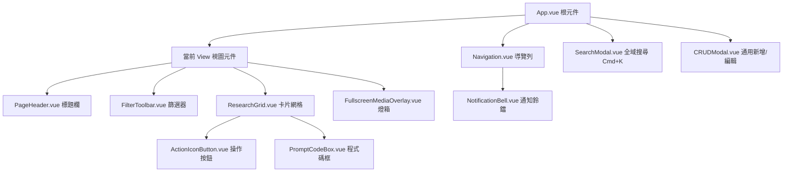
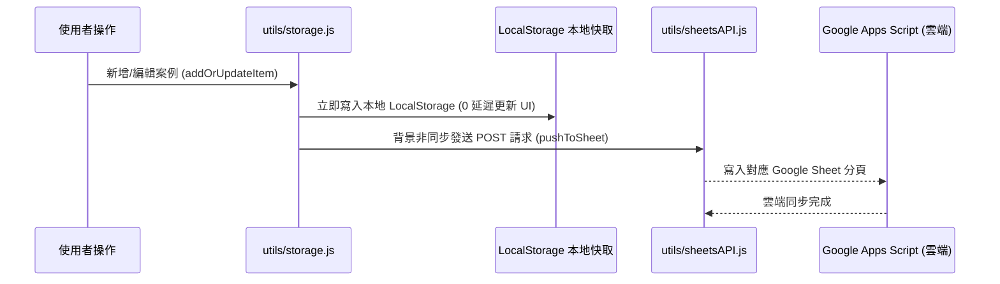

# Design LAB 內部設計資料庫 🚀

---

## 📑 目錄

- [專案簡介](#專案簡介)
- [核心功能特色](#核心功能特色)
- [開發環境與套件依賴](#開發環境與套件依賴)
- [快速開始](#快速開始)
- [專案目錄結構](#專案目錄結構)
- [CSS 與設計系統結構](#css-與設計系統結構)
- [頁面與路由架構](#頁面與路由架構)
- [核心元件結構](#核心元件結構)
- [資料架構與雲端同步](#資料架構與雲端同步)
- [身分驗證與權限管理](#身分驗證與權限管理)
- [維護與擴充指南](#維護與擴充指南)

---

## 專案簡介

**Design LAB** 專為產品設計師、前端工程師及產品團隊打造，提供一站式的設計知識沉澱與分析平台。支援豐富的多媒體案例展示（高解析截圖、流暢影片、互動預覽）、靈活的標籤過濾、即時全文搜尋（`Cmd + K`）、通用 CRUD 管理、8 套對比驗證的視覺主題切換，並無縫整合 Google Sheets 進行全自動雲端雙向同步。

---

## 核心功能特色

- 🎨 **現代化設計系統**：採用 Tailwind CSS v4 設計代幣（Design Tokens）與精緻 Glassmorphism 毛玻璃美學。
- 🌓 **8 套精心校準的視覺主題**：4 款深色（深邃夜幕、GitHub Dark、黑曜石暖調、極地冷夜）與 4 款淺色（雲白蔚藍、現代冷灰、辦公暗紅、極地雪白）。
- 🔍 **全域快捷搜尋 (`Cmd + K`)**：跨所有模組即時全文檢索，支援標題、描述、工具、標籤快速定位與自動跳轉。
- 🖼️ **沉浸式多媒體 Lightbox**：支援多圖切換、雙影片並排對比、全螢幕燈箱放大、鍵盤快捷鍵（`ESC` / 方向鍵）導航。
- ⚡ **自建輕量 Hash 路由**：無需外部龐大 Router 套件，網址與視圖/彈窗 ID 雙向同步（如 `#/ui-research/item-123`），支援重新整理與歷史紀錄。
- ☁️ **Google Sheets 雙向同步**：透過 Google Apps Script 後端實現資料雲端備份、多人即時同步與離線快取優先機制。
- 🔐 **細緻化權限與成員管理**：支援多角色（Super Admin / Admin / User / Guest）、密碼驗證、案例刪除防護與開發者帳號模擬。
- 🔔 **站內即時通知系統**：當案例新增、編輯、刪除或成員異動時自動記錄並提供小鈴鐺即時提醒。

---

## 開發環境與套件依賴

### 運行環境要求

- **Node.js**：`>= 18.0.0`
- **npm**：`>= 9.0.0`

### 核心技術棧與套件清單

| 分類 | 套件名稱 | 版本 | 說明 |
| :--- | :--- | :--- | :--- |
| **前端核心** | `vue` | `^3.5.39` | Vue 3 核心框架，全面採用 `<script setup>` Composition API |
| **構建工具** | `vite` | `^8.1.5` | 極速前端構建與開發伺服器 |
| **構建外掛** | `@vitejs/plugin-vue` | `^6.0.7` | Vite 官方 Vue 3 單檔案元件 (SFC) 編譯外掛 |
| **樣式框架** | `tailwindcss` | `^4.3.3` | Tailwind CSS v4 最新版（CSS-First 原生代幣系統） |
| **CSS 處理** | `@tailwindcss/postcss` | `^4.3.3` | Tailwind CSS PostCSS 整合外掛 |
| **CSS 處理** | `postcss` | `^8.5.26` | CSS 轉換工具 |

---

## 快速開始

### 1. 安裝依賴套件

```bash
npm install
```

### 2. 啟動本地開發伺服器

```bash
npm run dev
```
> 預設會啟動 Vite 本地開發伺服器（預設監聽 `http://localhost:5173`，支援局域網連線）。

### 3. 編譯正式發布版本

```bash
npm run build
```
> 編譯產物將輸出至 `dist/` 目錄，採用相對路徑打包（`base: './'`），可直接部署於各類靜態伺服器或 Web Server（如 Apache、Nginx）。

### 4. 預覽正式發布版本

```bash
npm run preview
```

---

## 專案目錄結構

```text
designLAB-website/
├── index.html                  # 應用程式入口 HTML
├── package.json                # 專案套件設定與腳本
├── postcss.config.js           # PostCSS 設定（載入 @tailwindcss/postcss）
├── vite.config.js              # Vite 構建設定（Vue 外掛、相對路徑 base、主機監聽）
├── public/                     # 靜態資源目錄
│   └── vite.svg                # 網站圖示
└── src/                        # 原始碼目錄
    ├── main.js                 # 應用程式入口（載入全域 CSS、掛載 Vue 實例）
    ├── App.vue                 # 根元件（佈局架構、Hash 路由同步、全域 Modal 管理）
    ├── style.css               # 全域樣式（Tailwind @theme、CSS 變數、8 套主題、全域 Reset）
    │
    ├── styles/                 # 模組化樣式
    │   └── components.css      # 共用 UI 樣式（毛玻璃面板、徽章、標籤、彈窗遮罩）
    │
    ├── views/                  # 主要頁面視圖 (Views)
    │   ├── Dashboard.vue       # 總覽儀表板 (首頁)
    │   ├── UIResearch.vue      # UI 設計研究模組
    │   ├── MotionResearch.vue  # 動態與微互動研究模組
    │   ├── Competitor.vue      # 競品與同業分析模組 (Web / 行動裝置)
    │   ├── AICenter.vue        # AI 工具與 Prompt 範本庫
    │   ├── Resources.vue       # 設計規範與資源下載庫
    │   ├── Proposals.vue       # 產品優化提案看板
    │   └── Settings.vue        # 個人設定、主題選擇、雲端同步與團隊成員管理
    │
    ├── components/             # 通用與業務元件
    │   ├── Navigation.vue      # 側邊欄導覽 (含響應式手機抽屜選單)
    │   ├── PageHeader.vue      # 各頁面標準頂部標題列
    │   ├── FilterToolbar.vue   # 多維度分類篩選與排序工具列
    │   ├── ResearchGrid.vue    # 研究案例卡片網格展示
    │   ├── FullscreenMediaOverlay.vue # 沉浸式多媒體全螢幕預覽燈箱
    │   ├── CRUDModal.vue       # 通用新增/編輯彈窗 (動態生成各模組表單)
    │   ├── SearchModal.vue     # 全域搜尋彈窗 (Cmd+K)
    │   ├── ThemeModal.vue      # 8 套視覺主題即時預覽與選取彈窗
    │   ├── NotificationBell.vue# 頂部即時通知小鈴鐺與訊息下拉清單
    │   ├── PromptCodeBox.vue   # AI 提示詞程式碼展示與一鍵複製元件
    │   ├── ActionIconButton.vue# 卡片快捷操作按鈕 (編輯/刪除/外部連結)
    │   ├── TagInput.vue        # 標籤輸入與增刪元件
    │   ├── CategoryInput.vue   # 分類選擇與自訂輸入元件
    │   ├── ImagePathInput.vue  # 圖片路徑/連結輸入元件
    │   └── FileUploader.vue    # 本地檔案上傳與 Base64 轉換元件
    │
    ├── data/                   # 預設與 Mock 資料集
    │   ├── mockData.js         # 統一匯出所有初始資料
    │   ├── uiResearch.js       # UI 研究初始資料
    │   ├── motionResearch.js   # 動態研究初始資料
    │   ├── competitor.js       # 競品分析初始資料
    │   ├── aiCenter.js         # AI 工具中心初始資料
    │   ├── resources.js        # 設計資源初始資料
    │   └── proposals.js        # 優化提案初始資料
    │
    └── utils/                  # 核心工具函式庫
        ├── storage.js          # 本地 LocalStorage 資料儲存與 CRUD 封裝
        ├── userStore.js        # 成員帳號、權限驗證、密碼管理與身分模擬
        ├── sheetsAPI.js        # Google Sheets Apps Script API 雲端雙向同步
        ├── notifications.js    # 全站通知記錄與廣播
        ├── upload.js           # 圖片與媒體上傳處理
        ├── formatters.js       # 標準時間與字串格式化
        └── clipboard.js        # 剪貼簿快速複製工具
```

---

## CSS 與設計系統結構

本專案採用 **Tailwind CSS v4** 原生架構搭配自訂 **CSS Custom Properties (CSS 變數)**，實現高度語義化與靈活的主題切換。

### 1. Tailwind v4 `@theme` 設計代幣架構 (`src/style.css`)

```css
@theme {
  /* 字體系統 */
  --font-sans: 'Outfit', 'Noto Sans TC', -apple-system, BlinkMacSystemFont, "Segoe UI", Roboto, sans-serif;
  --font-display: 'Outfit', 'Noto Sans TC', -apple-system, BlinkMacSystemFont, sans-serif;
  --font-body: 'Noto Sans TC', -apple-system, BlinkMacSystemFont, "Segoe UI", sans-serif;
  --font-mono: 'SFMono-Regular', Consolas, 'Liberation Mono', Menlo, monospace;

  /* 語義化色彩 (Semantic Color Tokens) */
  --color-brand: var(--color-primary);
  --color-brand-secondary: var(--color-secondary);
  --color-brand-accent: var(--color-accent);
  --color-surface-base: var(--bg-primary);
  --color-surface-card: var(--bg-card);
  --color-surface-elevated: var(--bg-elevated);
  --color-ink-primary: var(--text-primary);
  --color-ink-secondary: var(--text-secondary);
  --color-ink-muted: var(--text-muted);
  --color-border-hairline: var(--border-color);

  /* 圓角尺度 */
  --radius-xs: 4px;
  --radius-sm: 6px;
  --radius-md: 10px;
  --radius-lg: 14px;
  --radius-xl: 18px;
  --radius-2xl: 22px;
}
```

### 2. 8 套雙模視覺主題系統 (Dark & Light)

透過在頂層 `.app-container` 動態綁定主題 Class（如 `:class="currentTheme"`），全站即可無縫切換整套色票：

| 主題 Class | 模式 | 特色與色彩調性 |
| :--- | :--- | :--- |
| `.theme-cloud-canvas` *(預設)* | ☀️ 淺色 | **純白蔚藍 (Airy Crisp Pure White + Royal Azure)**，高明度、極致清爽現代感 |
| `.theme-material-light` | ☀️ 淺色 | **科技冷灰 (Cool Grey + Electric Azure)**，細緻灰階襯底與護眼對比 |
| `.theme-office-access` | ☀️ 淺色 | **經典暗紅 (Office Red + Paper White)**，專業沉穩紙本質感 |
| `.theme-nord-light` | ☀️ 淺色 | **極地雪白 (Arctic Crisp Ice Canvas)**，北歐冰川淡藍灰調 |
| `.theme-midnight-indigo` | 🌙 深色 | **深邃夜幕 (Palenight Purple Slate)**，奢華靛藍與柔和紫色高亮 |
| `.theme-github-dark` | 🌙 深色 | **極客炭灰 (Graphite Workshop)**，經典開發者暗黑高對比風 |
| `.theme-obsidian-neon` | 🌙 深色 | **黑曜暖銅 (Warm Ink + Copper)**，黑曜石底色搭配溫潤金屬銅色 |
| `.theme-nord-dark` | 🌙 深色 | **極地極夜 (Nord Polar Night)**，冷色調藍黑與北極光綠點綴 |

### 3. 共用元件樣式 (`src/styles/components.css`)

- `.glass-panel`：毛玻璃背景、微邊框與懸停深度效果。
- `.card-actions-reveal`：懸停/Focus 時平滑浮現的操作按鈕列。
- `.type-badge` / `.category-badge` / `.comp-badge`：色彩語義清晰的狀態與類型徽章。
- `.tool-tag` / `.tag` / `.clickable-tag`：支援可點擊篩選與主色反白的高質感標籤。
- `.modal-backdrop` / `.lightbox-backdrop`：背景 8px 高斯模糊遮罩與標準化彈窗分層。

### 4. 響應式佈局規範

- **側邊欄 (Sidebar)**：桌機版固定寬度 `260px`；平板 (≤ 1024px) 收合為 `72px` 緊湊模式；手機 (≤ 900px) 轉為底部/頂部懸浮漢堡選單抽屜。
- **Bento Grid**：桌機 4 欄 (`repeat(4, 1fr)`) ➔ 平板 2 欄 ➔ 手機單欄堆疊。

---

## 頁面與路由架構

### 輕量 Hash 路由機制

專案採用自建 Hash 路由處理器（監聽 `popstate` 與 `hashchange` 事件），無須重整頁面即可實現雙向同步：

| 路由 Hash | 對應 View 元件 | 頁面功能說明 |
| :--- | :--- | :--- |
| `#/dashboard` | `Dashboard.vue` | 總覽看板、數據統計卡片、最新案例動態、快速新增入口 |
| `#/ui-research` | `UIResearch.vue` | UI 介面案例庫、元件分類過濾、多圖預覽、規格與提示詞展示 |
| `#/motion-research` | `MotionResearch.vue` | 動態效果庫、微互動範例、雙影片播放、緩動曲線與技術細節 |
| `#/competitor` | `Competitor.vue` | 競品分析庫（區分 Web 平台與行動裝置雙維度）、優缺點剖析 |
| `#/ai-center` | `AICenter.vue` | AI 設計工具箱、分類工作流、Prompt 程式碼一鍵複製 |
| `#/resources` | `Resources.vue` | 設計規範、圖示庫、字型、外掛資源庫與外部直達連結 |
| `#/proposals` | `Proposals.vue` | 產品體驗優化提案看板（看板視圖 / 清單視圖切換） |
| `#/settings` | `Settings.vue` | 個人 Profile、密碼修改、主題更換、雲端同步、團隊成員管理 |

> 支援帶參數深度定位：例如訪問 `#/ui-research/ui-research-1` 會自動導向該頁面並觸發該項目的 Lightbox 彈窗預覽。

---

## 核心元件結構



### 重點元件介紹

1. **`CRUDModal.vue`**：
   - 根據傳入的 `type`（如 `UI_RESEARCH`、`COMPETITORS`、`AI_CENTER` 等）動態渲染對應表單欄位。
   - 整合 `TagInput`、`CategoryInput`、`ImagePathInput` 與 `FileUploader`。
2. **`FullscreenMediaOverlay.vue`**：
   - 支援大圖無損縮放、雙影片同時並排播放、鍵盤快捷鍵切換上下筆。
3. **`SearchModal.vue`**：
   - 支援全站熱鍵 `Cmd + K` (Mac) 或 `Ctrl + K` (Windows) 喚醒。
   - 即時跨模組全文檢索並標記命中欄位。
4. **`NotificationBell.vue`**：
   - 即時顯示未讀通知紅點、展示成員發布/編輯/刪除操作紀錄，支援一鍵全部已讀與清空。

---

## 資料架構與雲端同步

### 資料流轉架構



### 資料模組與 Key 對照

| 模組名稱 | LocalStorage Key | Google Sheet 分頁名稱 |
| :--- | :--- | :--- |
| **UI 設計研究** | `design_lab_ui_research` | `UI_RESEARCH` |
| **動態研究** | `design_lab_motion_research` | `MOTION_RESEARCH` |
| **競品分析** | `design_lab_competitors` | `COMPETITORS` |
| **AI 工具中心** | `design_lab_ai_center` | `AI_CENTER` |
| **設計資源** | `design_lab_resources` | `RESOURCES` |
| **優化提案** | `design_lab_proposals` | `PROPOSALS` |
| **團隊成員** | `design_lab_user_profiles` | `USERS` |
| **操作通知** | `design_lab_notifications` | `NOTIFICATIONS` |

### 離線優先與媒體保留策略

- 本地已上傳之 Base64 高解析圖片與影片，在自 Google Sheets 雲端拉取文字資料進行覆蓋合併時，系統會智慧保留同 ID 的本機多媒體快取，確保重新整理後畫面不遺失。

---

## 身分驗證與權限管理

### 角色權限矩陣

| 角色 (Role) | 識別代表 | 案例瀏覽/檢視 | 新增案例 | 編輯/刪除案例 | 帳號密碼修改 | 團隊成員管理 |
| :--- | :--- | :---: | :---: | :---: | :---: | :---: |
| **Admin** | 網站管理員 | ✅ | ✅ | ✅ (全站所有) | ✅ | ✅ (查看與排序) |
| **User** | 一般團隊成員 | ✅ | ✅ | 僅限自己建立的案例 | ✅ (自身密碼) | ❌ |
| **Guest** | 訪客 (`@guest`) | ✅ | ❌ | ❌ | ❌ | ❌ |

### 關鍵安全防護

- **防篡改機制**：非 Google Sheets 成員名單內之帳號嚴禁登入，系統絕不自動為未授權訪客建立寫入雲端。
- **管理員防誤刪**：系統核心 Super Admin 與 Admin 帳號受程式碼保護，禁止於前端刪除。
- **帳號模擬 (Impersonation)**：Super Admin 具備「身分模擬」功能，可無縫切換至其他成員或訪客視角進行體驗除錯，並可一鍵還原。

---

## 維護與擴充指南

### 1. 新增一個全新視圖 (View)

1. 在 `src/views/` 建立新頁面元件（例如 `MyNewView.vue`）。
2. 在 `src/data/` 建立對應的初始資料集並於 `mockData.js` 導出。
3. 在 `src/utils/storage.js` 及 `sheetsAPI.js` 新增對應的 `KEYS` 與 `KEY_MAP`。
4. 在 `src/App.vue` 中的 `viewComponentMap` 與 `VIEW_ROUTES` 註冊該 View。
5. 在 `src/components/Navigation.vue` 中的 `menuItems` 陣列加入選單圖示與名稱。

### 2. 擴充全新視覺主題

1. 在 `src/style.css` 中定義新的 Theme Class（例如 `.theme-cyberpunk`）。
2. 填寫該主題下的 `--bg-primary`、`--color-primary`、`--text-primary`、`--border-color` 等 CSS 變數。
3. 在 `src/components/ThemeModal.vue` 及 `src/views/Settings.vue` 的主題清單中加入新主題的選項資訊與色票預覽。

---

## 授權資訊

本專案為內部設計團隊專屬資產，未經許可請勿擅自對外散布或商用。
