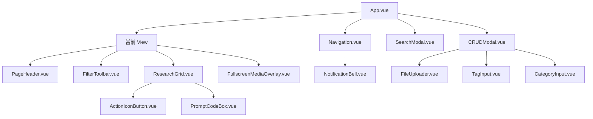
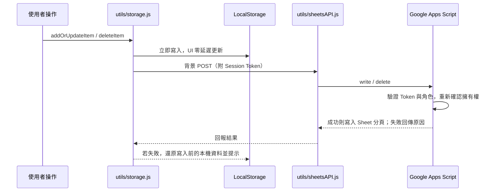

# Design LAB 內部設計資料庫

供產品設計師與前端團隊使用的內部設計知識庫。以 Vue 3 + Vite 建置的單頁應用，提供案例收錄、標籤篩選、全站搜尋、多媒體預覽、主題切換，並整合 Google Sheets 作為雲端資料層、Cloudflare R2 作為媒體儲存。

---

## 目錄

- [Design LAB 內部設計資料庫](#design-lab-內部設計資料庫)
  - [目錄](#目錄)
  - [功能總覽](#功能總覽)
  - [技術棧](#技術棧)
  - [快速開始](#快速開始)
  - [環境變數](#環境變數)
  - [部署](#部署)
  - [目錄結構](#目錄結構)
  - [路由與頁面](#路由與頁面)
  - [元件架構](#元件架構)
  - [樣式與主題系統](#樣式與主題系統)
    - [主題清單](#主題清單)
    - [共用樣式（`src/styles/components.css`）](#共用樣式srcstylescomponentscss)
    - [響應式斷點](#響應式斷點)
  - [資料層與雲端同步](#資料層與雲端同步)
    - [資料鍵對照](#資料鍵對照)
  - [媒體上傳架構](#媒體上傳架構)
    - [格式與容量限制](#格式與容量限制)
  - [帳號與權限](#帳號與權限)
    - [角色矩陣](#角色矩陣)
    - [安全機制](#安全機制)
  - [擴充指南](#擴充指南)
    - [新增資料模組](#新增資料模組)
    - [新增主題](#新增主題)
  - [已知限制](#已知限制)
  - [授權](#授權)

---

## 功能總覽

| 功能 | 說明 |
| :--- | :--- |
| 六大資料模組 | UI 研究、動態研究、競品分析、AI 工具、設計資源、優化提案 |
| 通用 CRUD | 單一 `CRUDModal` 依模組類型動態產生表單欄位 |
| 全域搜尋 | `Cmd + K` / `Ctrl + K` 跨模組全文檢索並直接跳轉至目標項目 |
| 多媒體預覽 | 全螢幕燈箱，支援多圖切換、雙影片並排、鍵盤導覽 |
| Hash 路由 | 自建輕量路由，網址與視圖／項目 ID 雙向同步 |
| 主題系統 | 8 套色票（4 深色 / 4 淺色），依使用者帳號記憶偏好 |
| 雲端同步 | 透過 Google Apps Script 與 Google Sheets 雙向同步 |
| 媒體儲存 | 前端取得預簽名網址後直傳 Cloudflare R2，附檔案管理器 |
| 權限控管 | Super Admin / Admin / User / Guest 四級角色與密碼登入 |
| 站內通知 | 記錄新增、編輯、刪除與成員異動，已讀滿三天自動清除 |

---

## 技術棧

執行環境需求：Node.js `>= 18`、npm `>= 9`。

| 分類 | 套件 | 版本 |
| :--- | :--- | :--- |
| 前端框架 | `vue` | `^3.5.39` |
| 建置工具 | `vite` | `^8.1.5` |
| Vue 外掛 | `@vitejs/plugin-vue` | `^6.0.7` |
| 樣式框架 | `tailwindcss` | `^4.3.3` |
| PostCSS 整合 | `@tailwindcss/postcss` | `^4.3.3` |
| CSS 處理 | `postcss` | `^8.5.26` |

專案無額外執行期相依套件：路由、狀態管理、HTTP 客戶端皆以原生 API 自建。

---

## 快速開始

```bash
npm install          # 安裝相依套件
cp .env.example .env # 填入 R2 憑證（媒體上傳功能所需）
npm run dev          # 啟動開發伺服器，預設 http://localhost:5173
npm run build        # 建置至 dist/
npm run preview      # 預覽建置產物
```

`vite.config.js` 內建 `designlab-r2-dev-api` 外掛，開發模式下會直接掛載 `api/` 三支 handler，因此本機不需另啟後端即可測試上傳、列表與刪除。

若未設定 R2 環境變數，應用其餘功能仍可正常運作，僅媒體上傳會回傳錯誤。

---

## 環境變數

R2 憑證僅供後端 `api/` 使用，**不可加上 `VITE_` 前綴**，以避免被打包進前端 bundle。

| 變數 | 用途 | 必填 |
| :--- | :--- | :--- |
| `R2_ACCOUNT_ID` | Cloudflare Account ID | 是 |
| `R2_ACCESS_KEY_ID` | R2 API Token 的 Access Key ID | 是 |
| `R2_SECRET_ACCESS_KEY` | R2 API Token 的 Secret Access Key | 是 |
| `R2_BUCKET_NAME` | Bucket 名稱，預設 `designlab-website` | 否 |
| `R2_PUBLIC_URL` | R2 公開存取網域 | 否 |
| `VITE_UPLOAD_API_URL` | API 與網站不同源時，填入 API 基礎網址 | 否 |

`VITE_UPLOAD_API_URL` 留白時，前端會以 `new URL('./api/', location.href)` 推導同源路徑；部署於 `/designLAB/` 子目錄時即對應 `/designLAB/api/`。

---

## 部署

1. 執行 `npm run build`，產物輸出至 `dist/`，採相對路徑（`base: './'`），可置於任意子目錄。
2. `api/` 下三支檔案為 Vercel Functions handler 格式，需部署至 Node 或 Serverless 執行環境。
3. 若以 Apache / Nginx 提供靜態 `dist`，須將 `/api/*` 反向代理至該執行環境。僅部署 `dist` 不會提供上傳 API。
4. 於 R2 Bucket 設定 CORS，允許網站來源對 S3 API endpoint 執行 `PUT`，並至少允許 `Content-Type` request header。刪除由後端簽章執行，不需開放 `DELETE`。正式環境的 `AllowedOrigins` 應限定實際網域。

---

## 目錄結構

```text
designLAB-website/
├── index.html                  # 應用入口
├── vite.config.js              # Vite 設定與開發用 R2 API middleware
├── postcss.config.js           # 載入 @tailwindcss/postcss
├── .env.example                # 環境變數範本
├── api/                        # R2 媒體上傳 handler（Vercel Functions 格式，與帳號權限無關）
│   ├── r2-upload-url.js        # AWS SigV4 簽章、預簽名上傳網址、檔案驗證
│   ├── r2-list.js              # 列出 Bucket 內既有媒體
│   └── r2-delete.js            # 刪除指定公開網址對應之物件
├── apps-script/                # Google Apps Script 後端原始碼（帳號、密碼、寫入權限的唯一信任邊界）
│   ├── Code.gs                 # 登入 / Session Token / 密碼雜湊 / 角色授權 / 資料讀寫
│   └── README.md               # 部署與首次設定步驟
├── public/
│   └── vite.svg
└── src/
    ├── main.js                 # 掛載 Vue 實例
    ├── App.vue                 # 根元件：佈局、Hash 路由、全域 Modal
    ├── styles/
    │   ├── tokens.css          # Tailwind @theme 代幣、CSS 變數、8 套主題（只放「值」）
    │   ├── base.css            # 全域 Reset、原生元素樣式、版面骨架、轉場
    │   └── components.css      # 共用樣式（毛玻璃面板、徽章、標籤、遮罩）
    ├── views/                  # 頁面層
    │   ├── Dashboard.vue       # 總覽儀表板
    │   ├── UIResearch.vue      # UI 設計研究
    │   ├── MotionResearch.vue  # 動態與微互動研究
    │   ├── Competitor.vue      # 競品分析（Web / 行動裝置）
    │   ├── AICenter.vue        # AI 工具與 Prompt 範本
    │   ├── Resources.vue       # 設計規範與資源
    │   ├── Proposals.vue       # 優化提案看板
    │   └── Settings.vue        # 登入、個人設定、雲端同步、成員管理
    ├── components/             # 共用元件
    │   ├── Navigation.vue      # 側邊欄與手機抽屜選單
    │   ├── PageHeader.vue      # 頁面標題列
    │   ├── FilterToolbar.vue   # 分類篩選與排序
    │   ├── ResearchGrid.vue    # 案例卡片網格
    │   ├── FullscreenMediaOverlay.vue  # 全螢幕媒體燈箱
    │   ├── CRUDModal.vue       # 通用新增／編輯彈窗
    │   ├── SearchModal.vue     # 全域搜尋
    │   ├── ThemeModal.vue      # 主題預覽與選取
    │   ├── NotificationBell.vue# 通知鈴鐺與清單
    │   ├── FileUploader.vue    # R2 上傳、進度、預覽與檔案管理器
    │   ├── PromptCodeBox.vue   # Prompt 展示與一鍵複製
    │   ├── ActionIconButton.vue# 卡片操作按鈕
    │   ├── TagInput.vue        # 標籤輸入
    │   ├── CategoryInput.vue   # 分類選擇與自訂
    │   └── ImagePathInput.vue  # 圖片路徑輸入
    ├── data/                   # 各模組初始資料，由 mockData.js 統一匯出
    └── utils/
        ├── storage.js          # LocalStorage CRUD、雲端寫入結果檢查與失敗回滾
        ├── userStore.js        # 顯示身分、角色快取、主題偏好、身分模擬（密碼不經過此層）
        ├── sheetsAPI.js        # Google Apps Script 讀寫、登入 / Session Token 管理
        ├── notifications.js    # 通知寫入、過濾與過期清理
        ├── upload.js           # 媒體驗證、預簽名上傳、列表與刪除
        ├── formatters.js       # 時間與字串格式化
        └── clipboard.js        # 剪貼簿複製
```

---

## 路由與頁面

路由由 `App.vue` 自建，監聽 `hashchange` 與 `popstate`，以 `VIEW_ROUTES` 對照表在網址與視圖名稱間雙向轉換。

| Hash | View | 說明 |
| :--- | :--- | :--- |
| `#/dashboard` | `Dashboard.vue` | 統計卡片、最新動態、快速新增入口 |
| `#/ui-research` | `UIResearch.vue` | UI 案例庫、分類篩選、多圖預覽 |
| `#/motion-research` | `MotionResearch.vue` | 動效與微互動、雙影片對照 |
| `#/competitor` | `Competitor.vue` | 競品分析，區分 Web 與行動裝置 |
| `#/ai-center` | `AICenter.vue` | AI 工具、工作流分類、Prompt 複製 |
| `#/resources` | `Resources.vue` | 設計規範、圖示、字型、外掛資源 |
| `#/proposals` | `Proposals.vue` | 提案看板，支援看板／清單視圖 |
| `#/settings` | `Settings.vue` | 登入、密碼、主題、同步、成員管理 |

網址支援第二段項目 ID，例如 `#/ui-research/ui-research-1` 會導向該頁並自動開啟對應燈箱。無法比對的 slug 會回退至 `#/dashboard`。

---

## 元件架構



`App.vue` 為唯一持有全域狀態的層級：主題 class 綁定於最外層 `.app-container`，搜尋彈窗與 CRUD 彈窗皆由此掛載，各 View 透過事件（`trigger-crud`、`navigate-detail`、`select-theme` 等）向上通知。

重點元件：

- **`CRUDModal.vue`** — 依 `type`（`UI_RESEARCH`、`MOTION_RESEARCH`、`COMPETITORS`、`AI_CENTER`、`RESOURCES`、`PROPOSALS`）切換表單版型，並整合標籤、分類與檔案上傳元件。
- **`FileUploader.vue`** — 拖放上傳、上傳進度、全螢幕預覽，並內建 R2 檔案管理器，可列出既有媒體、直接選用或刪除。
- **`SearchModal.vue`** — 熱鍵喚醒，跨模組檢索標題、描述、工具與標籤，標記命中欄位並跳轉。
- **`FullscreenMediaOverlay.vue`** — 多圖切換、雙影片並排播放、`ESC` 與方向鍵操作。
- **`NotificationBell.vue`** — 未讀紅點、操作紀錄清單、全部已讀與清空。

---

## 樣式與主題系統

採 Tailwind CSS v4 的 CSS-First 架構，於 `src/styles/tokens.css` 以 `@theme` 定義設計代幣，主題色票則以 CSS Custom Properties 分層覆寫。

```css
@theme {
  --font-sans:    'Outfit', 'Noto Sans TC', -apple-system, sans-serif;
  --font-display: 'Outfit', 'Noto Sans TC', sans-serif;
  --font-body:    'Noto Sans TC', -apple-system, sans-serif;
  --font-mono:    'SFMono-Regular', Consolas, Menlo, monospace;

  --color-brand:          var(--color-primary);
  --color-surface-base:   var(--bg-primary);
  --color-surface-card:   var(--bg-card);
  --color-ink-primary:    var(--text-primary);
  --color-border-hairline: var(--border-color);

  --radius-xs: 4px;  --radius-sm: 6px;  --radius-md: 10px;
  --radius-lg: 14px; --radius-xl: 18px; --radius-2xl: 22px;
}
```

### 主題清單

主題 class 綁定於 `.app-container`，切換時整套 CSS 變數一併替換。

| Class | 模式 | 色彩調性 |
| :--- | :--- | :--- |
| `.theme-cloud-canvas`（預設） | 淺色 | 雲端畫布，純白襯底搭配寶石藍 |
| `.theme-material-light` | 淺色 | 材質晴光，冷灰階與電光藍 |
| `.theme-office-access` | 淺色 | Office 酒紅，紙本質感 |
| `.theme-nord-light` | 淺色 | 極地雪原，北歐冰川淡藍灰 |
| `.theme-midnight-indigo` | 深色 | Palenight，靛藍底與柔紫高亮 |
| `.theme-github-dark` | 深色 | 石墨藍，開發者高對比暗色 |
| `.theme-obsidian-neon` | 深色 | 暖焰工坊，黑曜石底與銅色點綴 |
| `.theme-nord-dark` | 深色 | 極地暗夜，冷調藍黑與極光綠 |

舊版命名 `theme-midnight-slate`／`theme-charcoal-ember` 已在 `userStore.js` 的 `getUserTheme()` 做一次性轉換成現在的 `theme-midnight-indigo`／`theme-github-dark`，畫面上不會再套用舊 class，`tokens.css` 因此不需要再保留對應的別名選擇器。

### 共用樣式（`src/styles/components.css`）

- `.card-actions-reveal` — 懸停或 focus 時浮現的操作列。
- `.type-badge` / `.category-badge` / `.comp-badge` — 狀態與類型徽章。
- `.tool-tag` / `.tag` / `.clickable-tag` — 可點擊篩選的標籤。
- `.modal-backdrop` / `.lightbox-backdrop` — 高斯模糊遮罩與彈窗分層。

### 響應式斷點

- 側邊欄：桌機固定 `260px`；`≤ 1024px` 收合為 `72px`；`≤ 900px` 轉為抽屜選單。
- 卡片網格：桌機 4 欄、平板 2 欄、手機單欄。

---

## 資料層與雲端同步

資料採「本地優先、雲端非同步」策略：所有寫入先落 LocalStorage 以維持即時 UI 反應，再於背景推送至 Google Sheets。推送時會附帶登入取得的 Session Token；伺服器若因權限不足或登入逾期而拒絕，前端會還原本機這份資料到寫入前的狀態並提示使用者，而不是讓畫面停留在一個雲端其實沒有的假狀態。



### 資料鍵對照

| 模組 | LocalStorage Key | Sheet 分頁 |
| :--- | :--- | :--- |
| UI 設計研究 | `design_lab_ui_research` | `UI_RESEARCH` |
| 動態研究 | `design_lab_motion_research` | `MOTION_RESEARCH` |
| 競品分析 | `design_lab_competitors` | `COMPETITORS` |
| AI 工具中心 | `design_lab_ai_center` | `AI_CENTER` |
| 設計資源 | `design_lab_resources` | `RESOURCES` |
| 優化提案 | `design_lab_proposals` | `PROPOSALS` |
| 團隊成員 | `design_lab_user_profiles` | `USERS` |
| 操作通知 | `design_lab_notifications` | `NOTIFICATIONS` |

Apps Script 端點網址存於 `design_lab_sheets_url`，可於 Settings 頁面覆寫；未設定時使用 `sheetsAPI.js` 內的預設值。

`storage.js` 的 `normalizeItem()` 會在讀取時補齊舊版欄位（如 `source` / `link` 併入 `sourceUrl`），確保跨版本資料相容。自雲端拉取覆蓋本地時，系統會保留同 ID 項目的本機媒體欄位，避免既有預覽遺失。

---

## 媒體上傳架構

媒體檔案不進 LocalStorage，亦不轉為 Base64，一律直傳 Cloudflare R2，資料表僅保存公開網址。

1. 前端 `validateMediaFile()` 先行檢查副檔名與大小。
2. 呼叫 `POST /api/r2-upload-url` 取得有效期 900 秒的預簽名 `PUT` 網址。
3. 以 `XMLHttpRequest` 直傳 R2，並回報上傳進度。
4. 成功後回傳 `publicUrl`，寫入該筆資料的媒體欄位。

後端會重複驗證副檔名、大小與 `Content-Type` 是否一致，並以 `crypto.randomUUID()` 重新命名，存入 `images/` 或 `videos/` 前綴。刪除端點僅接受屬於本站 `R2_PUBLIC_URL` 且符合 `images/` 或 `videos/` 路徑規則的網址。R2 金鑰全程僅存在後端環境變數。

### 格式與容量限制

| 類型 | 格式 | 上限 |
| :--- | :--- | :--- |
| 圖片 | JPG、JPEG、PNG、WEBP | 5 MB |
| GIF | GIF | 10 MB |
| 影片 | MP4、WEBM、MOV | 50 MB |

單檔另有 100 MB 的總上限保護。

---

## 帳號與權限

登入介面位於 Settings 頁面。密碼驗證與角色授權**全部在 Google Apps Script 後端
（`apps-script/Code.gs`）執行**，前端只是轉送請求與呈現結果——這是本專案唯一具備
伺服器角色的地方，即使沒有傳統後端，也是實際的信任邊界。部署方式見
[`apps-script/README.md`](apps-script/README.md)。

登入成功會取得一組 Session Token（伺服器核發，存於 `CacheService`，6 小時效期，
使用中會自動延長），之後所有寫入 / 刪除 / 成員管理請求都必須附帶這個 Token；
伺服器會重新查驗 Token 對應的帳號與角色，不採信前端宣稱的身分。讀取維持公開、
不需登入，符合「訪客可瀏覽、寫入才要登入」的設計。

### 角色矩陣

| 角色 | 檢視 | 新增 | 編輯 | 刪除 | 修改密碼 | 成員管理 |
| :--- | :---: | :---: | :--- | :--- | :---: | :---: |
| Super Admin | 是 | 是 | 全站 | 全站 | 是 | 是（含身分模擬） |
| Admin | 是 | 是 | 全站 | 全站 | 是 | 是 |
| User | 是 | 是 | 全站（不限本人建立） | 僅限自建項目 | 僅自身 | 否 |
| Guest（`@guest`） | 是 | 否 | 否 | 否 | 否 | 否 |

### 安全機制

- **密碼雜湊** — `USERS` 分頁只存放加鹽迭代雜湊（SHA-256 × 2000 次），不存明文密碼；公開讀取（`doGet`）一律移除密碼相關欄位，前端從未取得、也無從比對任何密碼。
- **伺服器端授權** — 寫入 / 刪除 / 成員管理一律由 Apps Script 依 Token 對應的角色重新授權；前端的按鈕顯示與角色判斷僅供操作體驗使用，不是實際的權限邊界。
- **登入失敗鎖定** — 同一帳號連續 5 次登入失敗會鎖定 5 分鐘，降低密碼猜測攻擊效率。
- **名單控管** — 不在成員名單內的帳號無法登入，系統不會自動為未授權訪客建立雲端寫入權。
- **管理員保護** — Super Admin 與 Admin 帳號在伺服器端受保護，無法被刪除（含前端遭繞過的情況）。
- **編輯與刪除的擁有權規則不同** — 編輯開放給所有已登入（非訪客）使用者，不限本人建立，方便團隊共同維護同一批案例；刪除則較嚴格，伺服器會比對該筆資料實際記錄的建立者是否為目前登入者（或具管理員角色），而非採信前端傳來的欄位。新建項目的建立者資訊一律由伺服器依登入身分覆寫，前端無法冒名。
- **身分模擬** — 僅 Super Admin 可切換至其他成員或訪客視角預覽畫面，並隨時還原；此為純前端顯示切換，實際寫入權限仍以真正登入的 Session Token 為準。
- **通知過濾** — 一般使用者僅看到與自身相關的通知；訪客操作不留紀錄；已讀滿三天的訊息自動清除。

新建帳號的臨時密碼固定為 `123456`，並標記為「首次登入必須變更密碼」，登入後前端會強制彈出修改密碼視窗。管理員也可將任一成員密碼重設回這個臨時密碼、並重新要求對方強制變更。

---

## 擴充指南

### 新增資料模組

1. 於 `src/views/` 建立 View 元件。
2. 於 `src/data/` 建立初始資料並在 `mockData.js` 匯出。
3. 於 `storage.js` 的 `KEYS`、`sheetsAPI.js` 的 `KEY_MAP` 與 `STORAGE_KEY_MAP` 補上對應鍵。
4. 於 `App.vue` 的 `viewComponentMap` 與 `VIEW_ROUTES` 註冊。
5. 於 `Navigation.vue` 的 `menuItems` 加入選單項目。
6. 於 `CRUDModal.vue` 補上該 `type` 的表單版型與標題對照。

### 新增主題

1. 於 `src/styles/tokens.css` 定義主題 class，填寫 `--bg-primary`、`--color-primary`、`--text-primary`、`--border-color` 等變數。
2. 於 `ThemeModal.vue` 的 `themes` 陣列加入 class 與顯示名稱。
3. 於 `Settings.vue` 的主題清單同步補上選項與色票預覽。

---

## 已知限制

- 密碼雜湊與 Session 驗證雖已移至 Google Apps Script 後端，但 Apps Script 沒有原生的 bcrypt / Argon2，實作上以「每人一組隨機鹽 + SHA-256 迭代雜湊」折衷，強度不如專用密碼雜湊演算法（詳見 [`apps-script/README.md`](apps-script/README.md) 的「已知取捨」）。
- Google Apps Script 的 Web App 網址本身仍是公開資訊（讀取本來就要公開）；能編輯該 Apps Script 專案原始碼的人，等同擁有伺服器權限，這份存取權應比照一般後端機密妥善管理。
- LocalStorage 為單一裝置範圍，跨裝置一致性依賴 Sheets 同步；離線期間的寫入需重新連線後才會推送，且若寫入遭伺服器拒絕（例如登入已逾期），畫面會還原並提示，而非靜默失敗。
- 專案目前未配置測試與 lint 流程。

---

## 授權

本專案為內部設計團隊資產，未經許可請勿對外散布或商業使用。
